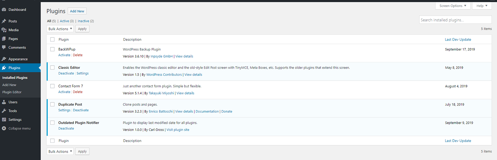

<!-- Outdated Plugin Notifier -->

 

<h1 style="display:inline;">Outdated Plugin Notifier</h1>

  <!--  
   -->
  <!--  -->
  
  
  
  <!--  -->
  

This WordPress plugin helps WordPress admins ensure their site continues to use plugins that are still maintained, rather than plugins that have been abandoned.  After installing the plugin, on the admin Plugins screen, it willl display specific information about each installed plugin.  Specifically, it will indicate the last time each plugin was updated.  To be even more specific, it will indicate the last time the developer for each plugin released an update for that particular plugin.

The latest stable version can be downloaded in zip format from the official WordPress plugin repo:  https://wordpress.org/plugins/outdated-plugin-notifier/

- [Installation](#installation)
- [Usage](#usage)
- [License](#license)

## Installation

### Automatic installation from WordPress Dashboard

1. From the WordPress dashboard, click _Plugins_ → _Add New_.
2. Search for "Outdated Plugin Notifier" in the top right search box.
3. Once the search completes, locate Outdated Plugin Notifier in the list and click _Install Now_.
4. After installation completes, click _Activate_.

## Usage

To use, simply install and activate the plugin. There is no additional configuration required. After, open the plugin admin page from your WordPress dashboard and you will see a new column displayed in the table: Last Dev Update. This column will indicate the last date the plugin was updated by its developer. If it has been several months–or years–since the developer last updated the plugin, you may want to contact the developer to confirm the plugin is still maintained. If the plugin is no longer in the WordPress plugin repository, Outdated Plugin Notifier will indicate so on the plugins admin page.

## License

[GPL v2.0](LICENSE)